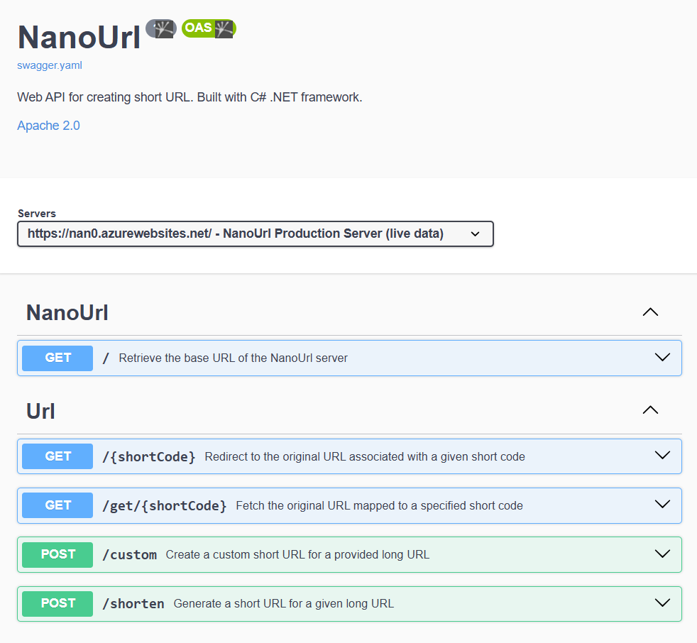
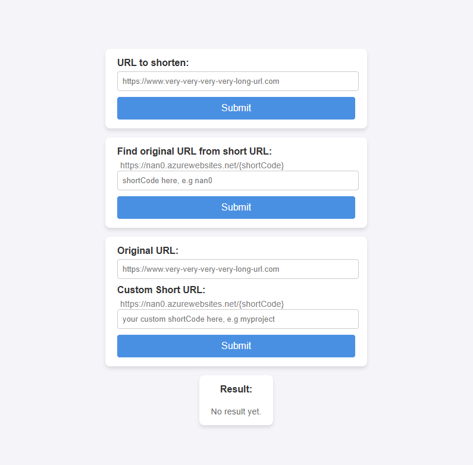

# NanoUrl - URL Shortening Web API

NanoUrl is a web-based URL shortening service built using **C#** and the **.NET framework**, designed to provide a simple and secure way to create short URLs. The service includes features such as creating custom short URL, URL mapping retrieval, and redirection. It utilizes **MongoDB** for storing URL mappings, **Azure Key Vault** for securely managing secrets and **Azure App Service** for hosting the Web API.

## Features

- **Shorten URLs**: Generate unique short URLs for any valid input URL
- **Custom Short Codes**: Create personalized short codes for URLs
- **Redirect**: Use short URLs to redirect user to the original URL
- **Secure & Scalable**: Implements Azure Key Vault for secure configuration and MongoDB for scalability
- **Interactive Documentation**: OpenAPI specification available with Swagger UI

## Technologies Used

- **Backend**: ASP.NET Core
- **Database**: MongoDB (hosted as a free MongoDB Atlas cluster)
- **Security**: Azure Key Vault for managing sensitive information (e.g., database connection strings)
- **Hosting**: Deployed on Azure App Service
- **API Documentation**: OpenAPI/Swagger interactive documentation [here](https://dh-giang-vu.github.io/NanoURL-OpenAPI/)
- **Example Client UI**: HTML, CSS, and JavaScript, deployed on GitHub Pages [here](https://dh-giang-vu.github.io/NanoUrl-client/)

## API Endpoints

| HTTP Method | Endpoint          | Description                                           |
|-------------|-------------------|-------------------------------------------------------|
| `GET`       | `/`               | Retrieve the base URL of the NanoUrl server          |
| `GET`       | `/{shortCode}`    | Redirect to the original URL associated with a short code |
| `GET`       | `/get/{shortCode}`| Fetch the original URL mapped to a specified short code |
| `POST`      | `/custom`         | Create a custom short URL for a given long URL       |
| `POST`      | `/shorten`        | Generate a short URL for a given long URL            |

### Example Usage

- **Create a Short URL**:
  ```http
  POST /shorten
  Content-Type: application/json

  "https://example.com"
  ```

  Response:
  ```json
  "nan0.azurewebsites.net/abc123"
  ```

- **Create a Custom Short URL**:
  ```http
  POST /custom
  Content-Type: application/json

  {
    "id": "this_field_is_optional",
    "original": "https://www.verylongurl.com/subdomain0/subdomain1",
    "shortCode": "myUrl"
  }
  ```

  Response:
  ```json
  "nan0.azurewebsites.net/myUrl"
  ```

## Demo / Deployed Version
- The live version of the API is hosted on Azure and can be accessed at: [https://nan0.azurewebsites.net](https://nan0.azurewebsites.net)

- **Interactive API Documentation**: The OpenAPI specification, deployed with Swagger UI, is available [here](https://dh-giang-vu.github.io/NanoURL-OpenAPI/). Use this to explore and test the API endpoints interactively.

<div align="center">
  
  <p style="margin-top: 7px;"><strong>Open API Swagger Documentation (API testing and demo)</strong></p>
</div>
  
- **Client UI**: A basic user interface for interacting with the API is available [here](https://dh-giang-vu.github.io/NanoUrl-client/). This is to demonstrate how users/developers can integrate their own UI to use NanoUrl API.

<div align="center">
  
  <p style="margin-top: 7px;"><strong>Client with UI (API integration with frontend)</strong></p>
</div>

## Security

- Critical configurations such as connection strings are securely stored in **Azure Key Vault**.
- The API enforces HTTPS for all requests.

## Project Highlights

This project demonstrates:
1. **Cloud Integration**: Use of Azure services like App Service and Key Vault.
2. **Scalable Database**: Integration with MongoDB Atlas for efficient data storage.
3. **API Best Practices**: Follows RESTful principles with OpenAPI documentation.
5. **Full-Stack Knowledge**: Implements backend development with C# and .NET and a front-end interface.

## Future Enhancements

- Add analytics to track usage statistics for shortened URLs.
- Improve error handling and user-friendly response messages.

## License

This project is licensed under the [MIT License](./LICENSE.txt).